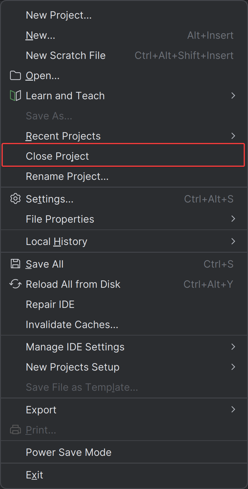
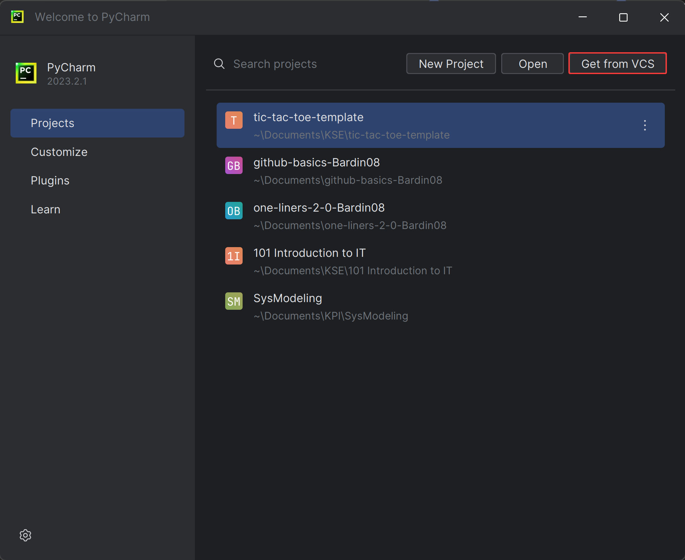
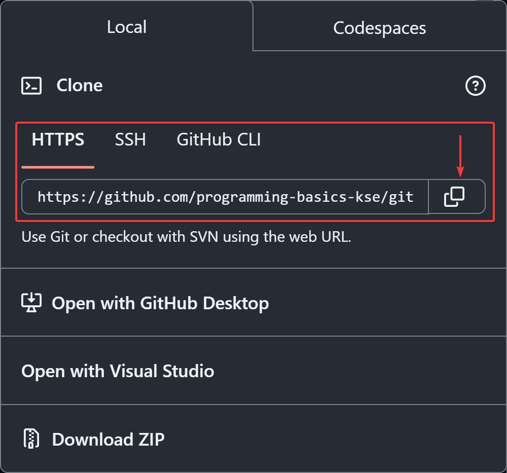
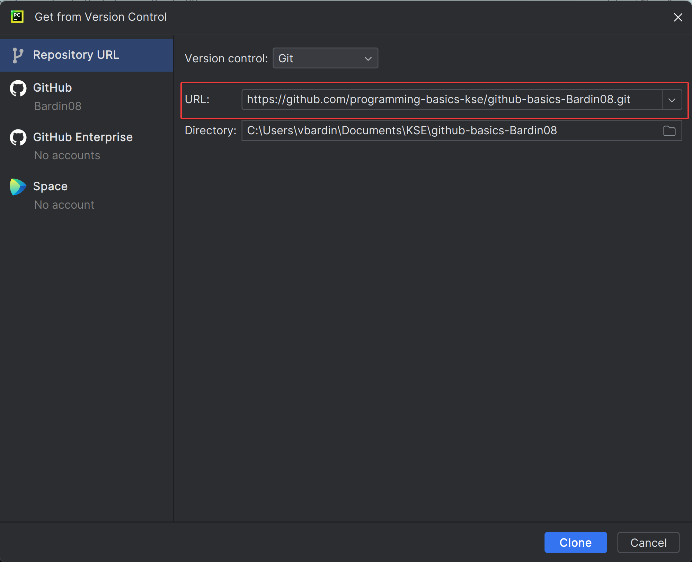
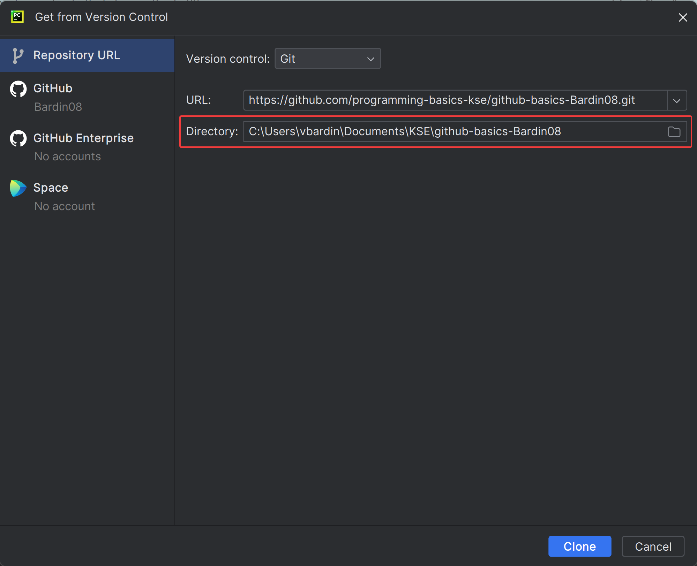
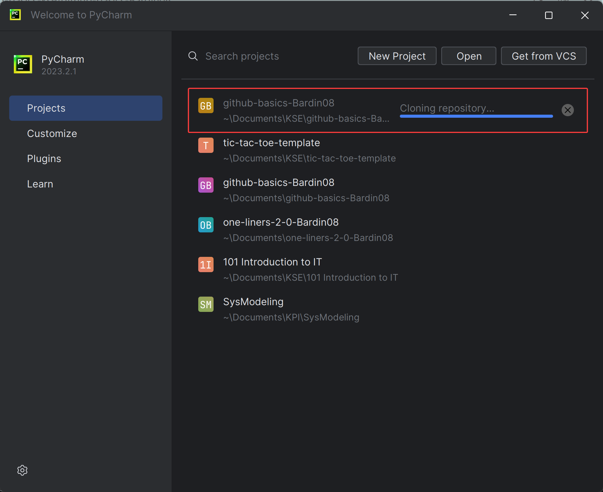

# PyCharm & GitHub integration: Clone Repository

## Prerequisites

- **Install Git:** Ensure Git is installed on your system. You can download it from [git-scm.com](https://git-scm.com/).
- **GitHub Account:** Have your GitHub account credentials ready. If you don't have a GitHub account, create one at
  [github.com](https://github.com/).
- **Configured GitHub Integration:** Ensure GitHub integration is configured on your IDE. You can follow
  this [guide](./readme.md) to do id.

## Cloning Repository From Remote VCS
- Click `File` > `Close Project` to close the current project & go to the start window

- Click `Get from VCS`

- Go to `GitHub` & Copy repo link

- In the `URL` field, enter the GitHub repository URL you want to clone.

- Specify the local directory where you want to clone the repository.

- Click Clone.

- Wait until cloning is complete

