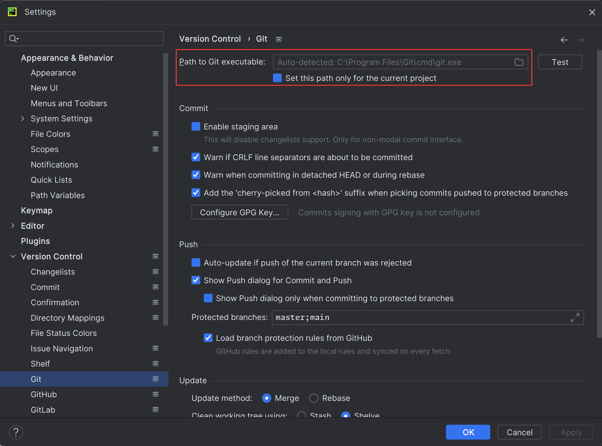

# PyCharm & GitHub integration

## Prerequisites

- **Install Git:** Ensure Git is installed on your system. You can download it from [git-scm.com](https://git-scm.com/).
- **GitHub Account:** Have your GitHub account credentials ready. If you don't have a GitHub account, create one at
  [github.com](https://github.com/).

## Setting up Git in PyCharm

1. Open PyCharm: Start PyCharm on your computer.
2. Access Preferences: Go to `File > Settings` (on Windows/Linux) or `PyCharm > Preferences` (on macOS).
3. Configure Git:
    - Navigate to `Version Control` > `Git`.
    - Click the `...` next to the `Path to Git executable` and ensure PyCharm has detected your Git installation, or
      navigate to it manually.
    - Click `OK` to save.

## Connecting to GitHub

1. Access GitHub Settings:
   - In the same `Settings` or `Preferences window`, go to `Version Control` > `GitHub`.
2. Add GitHub Account:
   - Click the `+` (Add) button. 

 GitHub" src="./img/vc_gh_window.png"/>

   - Use the token-based login.

 GitHub -> Token Login" src="./img/vc_gh_login_window.png"/>

   - On the opened window select required token scopes. At this step you define what IDE can do using your token.

 Create Token" src="./img/gh_token_window.png"/>

   - Copy generated token.

> [!IMPORTANT]
> This is the only time you see this token, so save it if you plan to use it later somewhere else

 Copy Token" src="./img/gh_token_copy.png"/>

   - Paste copied token to the `Add GitHub Account` popup window.

 GitHub -> Token Login" src="./img/vc_gh_login_add_account.png"/>

   - Find added account at the Accounts list.
   
 GitHub -> Accounts List" src="./img/vc_gh_account_added.png"/>

   - Click `OK` to save the account.

## Tips
- Regularly commit and push your changes to avoid losing work.
- Frequently pull changes if you’re collaborating with others.
- Make use of branches for features or bug fixes to maintain an organized workflow.